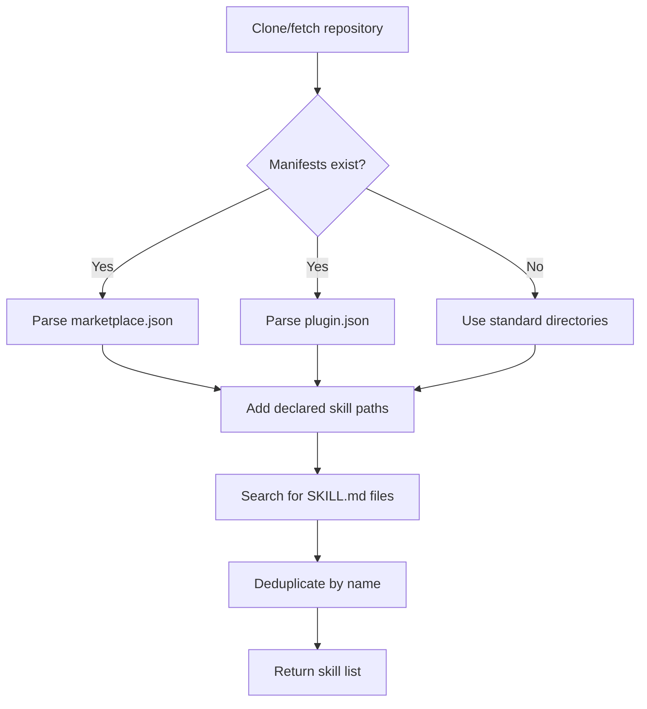

The Skills CLI supports skill discovery from **Claude Code plugin manifests**, enabling compatibility with the [Claude Code plugin marketplace](https://code.claude.com/docs/en/plugin-marketplaces) ecosystem.

## Overview

Plugin manifests allow you to:

- Declare skills explicitly instead of relying on directory conventions
- Group multiple skills under a named plugin
- Define multi-plugin repositories (marketplace catalogs)
- Maintain compatibility with Claude Code's plugin system

<Info>
  Plugin manifests are **optional**. The CLI will still discover skills in standard locations even without manifests.
</Info>

---

## Supported Manifest Files

The CLI looks for these files in a repository:

<CardGroup cols={2}>
  <Card title="marketplace.json" icon="store">
    Multi-plugin catalog  
    Location: `.claude-plugin/marketplace.json`
  </Card>
  
  <Card title="plugin.json" icon="plug">
    Single plugin  
    Location: `.claude-plugin/plugin.json`
  </Card>
</CardGroup>

---

## Marketplace Manifest

A **marketplace manifest** defines multiple plugins in a single repository.

### File Location

```
.claude-plugin/marketplace.json
```

### Schema

<CodeGroup>
```json Example Marketplace
{
  "metadata": {
    "pluginRoot": "./plugins"
  },
  "plugins": [
    {
      "name": "document-skills",
      "source": "./document-tools",
      "skills": [
        "./skills/markdown-formatter",
        "./skills/doc-generator"
      ]
    },
    {
      "name": "web-skills",
      "source": "./web-tools",
      "skills": [
        "./skills/react-best-practices"
      ]
    }
  ]
}
```
</CodeGroup>

### Fields

<ResponseField name="metadata" type="object">
  Global metadata for the marketplace

  <Expandable title="Metadata Fields">
    <ResponseField name="pluginRoot" type="string">
      Base directory for all plugins. Must start with `./` (relative path)
      
      **Example:** `"./plugins"`
    </ResponseField>
  </Expandable>
</ResponseField>

<ResponseField name="plugins" type="array" required>
  Array of plugin definitions

  <Expandable title="Plugin Entry">
    <ResponseField name="name" type="string">
      Plugin name for grouping skills (e.g., `"document-skills"`)
      
      This name is stored in the lock file's `pluginName` field.
    </ResponseField>

    <ResponseField name="source" type="string | object">
      Plugin location:
      - **String:** Relative path starting with `./` (e.g., `"./my-plugin"`)
      - **Object:** Remote source with `source` and optional `repo` fields (skipped by CLI)
      
      The CLI only processes local string paths.
    </ResponseField>

    <ResponseField name="skills" type="string[]">
      Array of skill paths relative to the plugin directory. Each path must start with `./`
      
      **Example:** `["./skills/formatter", "./skills/validator"]`
    </ResponseField>
  </Expandable>
</ResponseField>

### Path Resolution

Paths are resolved in this order:

1. Start with repository root
2. Apply `metadata.pluginRoot` if present
3. Apply `plugin.source` if present
4. Apply each skill path from `plugin.skills`

<CodeGroup>
```typescript Resolution Example
// Given this manifest:
{
  "metadata": { "pluginRoot": "./plugins" },
  "plugins": [
    {
      "source": "./document-tools",
      "skills": ["./skills/formatter"]
    }
  ]
}

// Skill path resolves to:
// {repo_root}/plugins/document-tools/skills/formatter/SKILL.md
```
</CodeGroup>

---

## Plugin Manifest

A **plugin manifest** defines a single plugin at the repository root.

### File Location

```
.claude-plugin/plugin.json
```

### Schema

<CodeGroup>
```json Example Plugin
{
  "name": "my-plugin",
  "skills": [
    "./skills/react-best-practices",
    "./skills/typescript-guide"
  ]
}
```
</CodeGroup>

### Fields

<ResponseField name="name" type="string">
  Plugin name for grouping skills
</ResponseField>

<ResponseField name="skills" type="string[]">
  Array of skill paths relative to the repository root. Each path must start with `./`
</ResponseField>

### Path Resolution

Paths are resolved relative to the repository root:

<CodeGroup>
```typescript Resolution Example
// Given this manifest:
{
  "name": "my-plugin",
  "skills": ["./skills/formatter"]
}

// Skill path resolves to:
// {repo_root}/skills/formatter/SKILL.md
```
</CodeGroup>

---

## Security: Path Validation

All paths in plugin manifests are validated to prevent path traversal attacks.

### Validation Rules

<Steps>
  <Step title="Relative path check">
    All paths must start with `./` per the Claude Code convention
  </Step>

  <Step title="Containment check">
    Resolved paths must be contained within the repository root (no `..` segments allowed)
  </Step>

  <Step title="Normalization">
    Paths are normalized before checking containment
  </Step>
</Steps>

### Invalid Paths

<CodeGroup>
```json Invalid Examples
{
  "skills": [
    "../../../etc/passwd",     // ❌ Path traversal
    "/absolute/path",           // ❌ Absolute path
    "relative/path",            // ❌ Missing ./
    "./skills/../../../etc"    // ❌ Escapes repo root
  ]
}
```

```json Valid Examples
{
  "skills": [
    "./skills/formatter",       // ✅ Relative, contained
    "./plugins/web/skill",      // ✅ Nested, contained
    "./skill"                   // ✅ Shallow, contained
  ]
}
```
</CodeGroup>

---

## How Discovery Works

When you run `skills add <source>`, the CLI searches for skills in this order:

<Steps>
  <Step title="Check for manifests">
    Look for `.claude-plugin/marketplace.json` or `.claude-plugin/plugin.json`
  </Step>

  <Step title="Extract declared skills">
    If manifests exist, add their skill paths to the search list
  </Step>

  <Step title="Add conventional directories">
    Always search standard locations like `skills/`, `.agents/skills/`, etc.
  </Step>

  <Step title="Discover SKILL.md files">
    Find all `SKILL.md` files in the search directories
  </Step>

  <Step title="Deduplicate">
    Remove duplicate skills based on normalized name
  </Step>
</Steps>

### Discovery Flow



---

## Plugin Grouping

Skills discovered from manifests can be grouped by plugin name.

### In Lock Files

When a skill is installed from a manifest with a `name` field, the plugin name is stored:

<CodeGroup>
```json Global Lock File
{
  "skills": {
    "markdown-formatter": {
      "source": "owner/repo",
      "sourceType": "github",
      "pluginName": "document-skills",  // ← From manifest
      "skillFolderHash": "abc123..."
    }
  }
}
```
</CodeGroup>

### In Skill Lists

The `skills list` command can group skills by plugin:

<CodeGroup>
```bash Example Output
$ skills list

Project Skills (.agents/skills/)

  document-skills
  • markdown-formatter
  • doc-generator

  web-skills  
  • react-best-practices

  (ungrouped)
  • standalone-skill
```
</CodeGroup>

---

## Implementation Details

### Source Code

Plugin manifest support is implemented in `src/plugin-manifest.ts`:

<CodeGroup>
```typescript Key Functions
import { getPluginSkillPaths, getPluginGroupings } from './plugin-manifest';

// Get skill search directories from manifests
const searchDirs = await getPluginSkillPaths('/path/to/repo');
// Returns: [
//   '/path/to/repo/plugins/document-tools/skills/formatter',
//   '/path/to/repo/skills',  // conventional fallback
//   ...
// ]

// Get plugin name for each skill path
const groupings = await getPluginGroupings('/path/to/repo');
// Returns: Map<AbsolutePath, PluginName>
// Example: Map {
//   '/abs/path/to/skill' => 'document-skills'
// }
```
</CodeGroup>

### API

<ParamField path="getPluginSkillPaths" type="function">
  Extract skill search directories from plugin manifests

  <Expandable title="Signature">
    ```typescript
    async function getPluginSkillPaths(basePath: string): Promise<string[]>
    ```

    <ParamField body="basePath" type="string" required>
      Repository root directory
    </ParamField>

    <ResponseField name="returns" type="string[]">
      Array of absolute paths to directories containing skills
    </ResponseField>
  </Expandable>
</ParamField>

<ParamField path="getPluginGroupings" type="function">
  Get a map of skill paths to plugin names

  <Expandable title="Signature">
    ```typescript
    async function getPluginGroupings(basePath: string): Promise<Map<string, string>>
    ```

    <ParamField body="basePath" type="string" required>
      Repository root directory
    </ParamField>

    <ResponseField name="returns" type="Map<string, string>">
      Map of absolute skill path to plugin name
    </ResponseField>
  </Expandable>
</ParamField>

---

## Examples

### Basic Marketplace

<CodeGroup>
```json .claude-plugin/marketplace.json
{
  "plugins": [
    {
      "name": "core-skills",
      "skills": [
        "./skills/formatter",
        "./skills/validator"
      ]
    }
  ]
}
```
</CodeGroup>

### Marketplace with Plugin Root

<CodeGroup>
```json .claude-plugin/marketplace.json
{
  "metadata": {
    "pluginRoot": "./packages"
  },
  "plugins": [
    {
      "name": "web-tools",
      "source": "./web",
      "skills": ["./skills/react"]
    },
    {
      "name": "api-tools",
      "source": "./api",
      "skills": ["./skills/rest"]
    }
  ]
}
```

```text Directory Structure
repo/
├── .claude-plugin/
│   └── marketplace.json
└── packages/
    ├── web/
    │   └── skills/
    │       └── react/
    │           └── SKILL.md
    └── api/
        └── skills/
            └── rest/
                └── SKILL.md
```
</CodeGroup>

### Simple Plugin

<CodeGroup>
```json .claude-plugin/plugin.json
{
  "name": "typescript-guide",
  "skills": [
    "./skills/setup",
    "./skills/best-practices",
    "./skills/testing"
  ]
}
```
</CodeGroup>

---

## Related Documentation

<CardGroup cols={2}>
  <Card title="Lock Files" icon="lock" href="/advanced/lock-files">
    See how pluginName is stored in lock files
  </Card>
  
  <Card title="Claude Code Plugins" icon="external-link" href="https://code.claude.com/docs/en/plugin-marketplaces">
    Learn about the Claude Code plugin marketplace
  </Card>
</CardGroup>